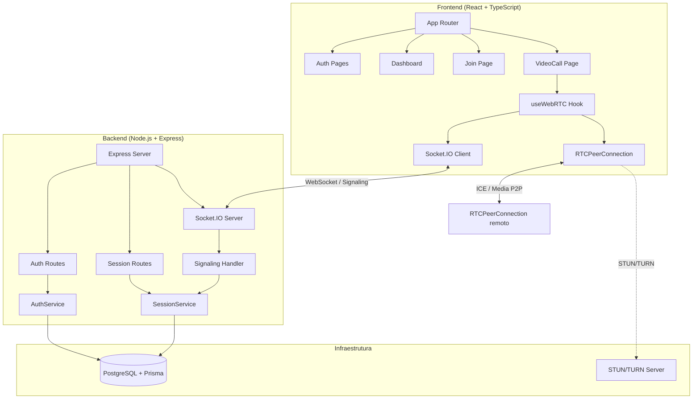
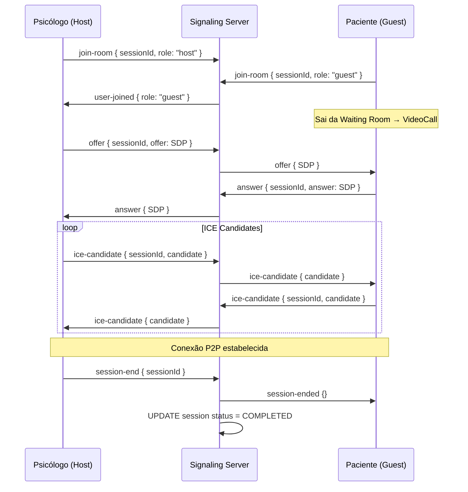

# Design Document — PsiConnect Platform

## Overview

O PsiConnect é uma plataforma web de videochamadas terapêuticas que conecta psicólogos (hosts) a pacientes (guests) via WebRTC peer-to-peer. A base de código já existe parcialmente; este design cobre as lacunas de implementação identificadas nos requisitos:

1. **Backend**: registrar rotas/middlewares no servidor, corrigir sinalização Socket.IO (limite de 2 participantes, `session-ended`, atualização de status no DB, validação de token expirado com 410)
2. **Frontend**: páginas `/register` e `/join/:token`, sala de espera, Dashboard funcional, VideoCall com WebRTC real integrado ao Socket.IO
3. **Segurança**: proteção de rotas por psicólogo, conformidade com LGPD

A arquitetura segue o padrão já estabelecido no projeto: REST API + Socket.IO para sinalização, WebRTC P2P para mídia, JWT em HTTP-only cookies para autenticação.

---

## Architecture

### Visão Geral do Sistema



### Fluxo de Sinalização WebRTC



### Fluxo de Autenticação

```mermaid
sequenceDiagram
    participant C as Cliente (Browser)
    participant B as Backend

    C->>B: POST /auth/login { email, password }
    B->>B: bcrypt.compare + jwt.sign
    B->>C: Set-Cookie: jwt=<token>; HttpOnly
    C->>B: GET /sessions (Cookie: jwt=<token>)
    B->>B: authenticateToken middleware
    B->>C: 200 { sessions[] }
```

---

## Components and Interfaces

### Backend — Mudanças Necessárias

#### 1. `backend/src/index.ts` — Registro de Rotas e Middlewares

O servidor atual não registra `cookie-parser` nem as rotas definidas em `routes/index.ts`. As seguintes adições são necessárias:

```typescript
import cookieParser from "cookie-parser";
import router from "./routes/index";

// Após app.use(express.json()):
app.use(cookieParser());
app.use("/api", router);
```

A ordem dos middlewares é crítica: `cookie-parser` deve vir antes das rotas; o handler de erros deve ser o último.

#### 2. `backend/src/socket/signalingHandler.ts` — Novo módulo de sinalização

O handler Socket.IO atual em `index.ts` não implementa:
- Limite de 2 participantes por sala
- Evento `session-end` / `session-ended`
- Atualização de status no banco ao encerrar
- Emissão de `user-left` ao desconectar

Interface do módulo:

```typescript
interface RoomState {
  participants: Map<string, { socketId: string; role: "host" | "guest" }>;
}

// rooms: Map<sessionId, RoomState>
export function registerSignalingHandlers(io: Server, prisma: PrismaClient): void
```

Lógica de `join-room`:
1. Verificar se a sala já tem 2 participantes → emitir `room-full` e rejeitar
2. Adicionar socket à sala e ao Map interno
3. Emitir `user-joined` para o outro participante

Lógica de `disconnect`:
1. Identificar em qual sala o socket estava
2. Emitir `user-left` para o participante restante
3. Remover o socket do Map; se a sala ficar vazia, deletar a entrada

Lógica de `session-end`:
1. Emitir `session-ended` para todos na sala
2. Chamar `SessionService.updateSessionStatus(sessionId, "COMPLETED")`
3. Limpar a sala do Map

#### 3. `backend/src/controllers/index.ts` — Correções

`validateSessionToken` precisa retornar dados da sessão (data, hora, nome do psicólogo) e distinguir entre token inválido (404) e token expirado/sessão encerrada (410):

```typescript
// Retorno esperado em caso de sucesso:
{
  sessionId: string;
  scheduledAt: string;
  durationMinutes: number;
  psychologistName: string;
}
```

`getSession` precisa verificar se a sessão pertence ao psicólogo autenticado (403 caso contrário).

#### 4. `backend/src/services/index.ts` — Correções

`validateAccessToken` precisa:
- Retornar 404 para token inexistente
- Retornar 410 para sessões `CANCELLED` ou `COMPLETED`
- Calcular expiração com base em `scheduledAt + durationMinutes + 30min` e retornar 410 se expirado

`createSession` precisa:
- Rejeitar `scheduledAt` no passado (400)
- Calcular `accessToken` com expiração correta baseada na duração da sessão

### Frontend — Novos Componentes e Páginas

#### 1. `frontend/src/pages/Register.tsx`

Formulário com campos: nome, e-mail, senha, CRP (opcional). Ao submeter com sucesso, redireciona para `/login`.

#### 2. `frontend/src/pages/JoinSession.tsx`

Rota: `/join/:token`

Fluxo:
1. Ao montar, chama `GET /api/sessions/join/:token`
2. Se 404 → exibe "Link inválido"
3. Se 410 → exibe "Esta sessão não está mais disponível"
4. Se 200 → exibe formulário solicitando nome do paciente
5. Ao submeter nome → armazena `{ patientName, token, sessionId }` em `sessionStorage` → navega para `/call/:sessionId?role=guest`

#### 3. `frontend/src/pages/WaitingRoom.tsx`

Exibido quando o paciente entra antes do psicólogo. Mantém conexão Socket.IO ativa. Ao receber `user-joined`, navega para a videochamada ativa.

Reconexão: até 3 tentativas com intervalo de 3 segundos (configurado no cliente Socket.IO).

#### 4. `frontend/src/pages/Dashboard.tsx` — Refatoração

Substituir placeholder por implementação real:
- `useEffect` para buscar sessões via `GET /api/sessions`
- Formulário modal para criar nova sessão
- Lista de sessões com data, hora, duração, status e botão "Copiar link"
- Botão "Iniciar" que navega para `/call/:sessionId?role=host`

#### 5. `frontend/src/pages/VideoCall.tsx` — Refatoração

Substituir placeholder por integração real com `useWebRTC`:
- Detectar `role` via query param ou `sessionStorage`
- Renderizar `<VideoTile>` para stream local (miniatura) e remoto (destaque)
- Exibir `<WaitingRoom>` enquanto `connectionState !== "connected"` e role é guest
- Diálogo de confirmação antes de encerrar (apenas para host)
- Ao receber `session-ended`, redirecionar guest para tela de encerramento

#### 6. `frontend/src/hooks/useWebRTC.ts` — Refatoração

O hook atual não integra Socket.IO. Precisa:
- Receber `socket` como parâmetro ou usar `getSocket()`
- Registrar listeners: `offer`, `answer`, `ice-candidate`, `user-joined`, `session-ended`
- Emitir `join-room` ao inicializar
- Criar offer quando `user-joined` é recebido e role é host
- Criar answer quando `offer` é recebido e role é guest
- Emitir `ice-candidate` ao gerar candidatos ICE
- Implementar lógica de reconexão (até 3 tentativas)
- Emitir `session-end` quando `endCall` é chamado pelo host

Interface atualizada:

```typescript
interface UseWebRTCOptions {
  sessionId: string;
  role: "host" | "guest";
  onSessionEnded?: () => void;
  onError?: (error: Error) => void;
}

interface UseWebRTCReturn {
  localStream: MediaStream | null;
  remoteStream: MediaStream | null;
  isMicMuted: boolean;
  isCameraOff: boolean;
  connectionState: "idle" | "connecting" | "connected" | "failed";
  toggleMic: () => void;
  toggleCamera: () => void;
  endCall: () => void;
}
```

#### 7. `frontend/src/App.tsx` — Novas Rotas

```typescript
<Route path="/register" element={<Register />} />
<Route path="/join/:token" element={<JoinSession />} />
```

---

## Data Models

### Prisma Schema (sem alterações necessárias)

O schema atual já suporta todos os requisitos. Os campos `startedAt` e `endedAt` já existem para rastreamento de ciclo de vida da sessão.

```prisma
model Psychologist {
  id           String    @id @default(uuid())
  name         String
  email        String    @unique
  passwordHash String
  crp          String?
  createdAt    DateTime  @default(now())
  updatedAt    DateTime  @updatedAt
  sessions     Session[]
}

model Session {
  id              String        @id @default(uuid())
  psychologistId  String
  psychologist    Psychologist  @relation(...)
  scheduledAt     DateTime
  durationMinutes Int           @default(50)
  status          SessionStatus @default(SCHEDULED)
  accessToken     String        @unique
  startedAt       DateTime?
  endedAt         DateTime?
  createdAt       DateTime      @default(now())
  updatedAt       DateTime      @updatedAt
}

enum SessionStatus {
  SCHEDULED
  IN_PROGRESS
  COMPLETED
  CANCELLED
}
```

### Estado do Frontend (Zustand)

`AuthStore` — sem alterações necessárias.

`SessionStore` — adicionar campo `patientName` para o fluxo do paciente:

```typescript
interface SessionState {
  sessionId: string | null;
  role: "host" | "guest" | null;
  status: "waiting" | "active" | "ended";
  patientName: string | null;        // novo
  accessToken: string | null;        // novo
  // ... métodos existentes
  setPatientInfo: (name: string, token: string) => void;
}
```

### Tipos de Eventos Socket.IO

```typescript
// Cliente → Servidor
interface JoinRoomPayload   { sessionId: string; role: "host" | "guest" }
interface OfferPayload      { sessionId: string; offer: RTCSessionDescriptionInit }
interface AnswerPayload     { sessionId: string; answer: RTCSessionDescriptionInit }
interface IceCandidatePayload { sessionId: string; candidate: RTCIceCandidateInit }
interface SessionEndPayload { sessionId: string }

// Servidor → Cliente
interface UserJoinedPayload { role: "host" | "guest" }
// user-left, session-ended: sem payload
// room-full: { error: string }
```

### Respostas da API

```typescript
// GET /api/sessions/join/:token — sucesso
interface ValidateTokenResponse {
  sessionId: string;
  scheduledAt: string;       // ISO 8601
  durationMinutes: number;
  psychologistName: string;
}

// POST /api/sessions — sucesso
interface CreateSessionResponse {
  id: string;
  scheduledAt: string;
  durationMinutes: number;
  status: SessionStatus;
  accessToken: string;
  createdAt: string;
}

// GET /api/sessions — sucesso
type ListSessionsResponse = CreateSessionResponse[];
```

---

## Correctness Properties


*Uma propriedade é uma característica ou comportamento que deve ser verdadeiro em todas as execuções válidas do sistema — essencialmente, uma declaração formal sobre o que o sistema deve fazer. Propriedades servem como ponte entre especificações legíveis por humanos e garantias de correção verificáveis por máquina.*

### Property 1: Registro cria conta com senha hasheada

*Para qualquer* conjunto válido de dados de registro (nome, e-mail, senha ≥ 8 chars), o Auth_Service deve criar a conta com status 201 e armazenar a senha como hash bcrypt — nunca em texto plano.

**Validates: Requirements 1.1**

### Property 2: E-mail duplicado é rejeitado com 409

*Para qualquer* e-mail já cadastrado no sistema, uma tentativa de registro com o mesmo e-mail deve retornar status 409.

**Validates: Requirements 1.2**

### Property 3: Inputs inválidos de registro retornam 400

*Para qualquer* combinação de campos obrigatórios ausentes ou inválidos (e-mail malformado, senha < 8 chars, nome ausente), o backend deve retornar status 400 identificando os campos inválidos.

**Validates: Requirements 1.3, 1.4**

### Property 4: Login com credenciais válidas define cookie HTTP-only

*Para qualquer* psicólogo registrado, fazer login com as credenciais corretas deve resultar em um cookie `jwt` com flag `HttpOnly` sendo definido na resposta, com expiração de 8 horas.

**Validates: Requirements 2.1, 2.5**

### Property 5: Credenciais inválidas retornam 401 genérico

*Para qualquer* combinação de e-mail/senha incorretos, o Auth_Service deve retornar status 401 com mensagem genérica que não revela qual campo está incorreto.

**Validates: Requirements 2.2**

### Property 6: Logout invalida o cookie JWT

*Para qualquer* psicólogo autenticado, realizar logout deve resultar no cookie `jwt` sendo limpo (maxAge=0) e retornar status 200. Requisições subsequentes a rotas protegidas devem retornar 401.

**Validates: Requirements 2.3**

### Property 7: Rotas protegidas rejeitam requisições sem token válido

*Para qualquer* rota protegida da API, uma requisição sem cookie JWT válido (ausente ou expirado) deve retornar status 401.

**Validates: Requirements 2.4, 3.2**

### Property 8: Criação de sessão persiste no banco com accessToken único

*Para qualquer* conjunto válido de dados de sessão (scheduledAt futuro, durationMinutes válido), o Session_Service deve persistir a sessão no banco e retornar um `accessToken` único. Consultar a sessão pelo ID deve retornar os mesmos dados.

**Validates: Requirements 4.1**

### Property 9: Expiração do accessToken respeita scheduledAt + duração + 30min

*Para qualquer* sessão criada com `scheduledAt` e `durationMinutes`, o `accessToken` JWT deve ter expiração igual a `scheduledAt + durationMinutes + 30 minutos`.

**Validates: Requirements 4.2**

### Property 10: Listagem de sessões retorna apenas sessões do psicólogo autenticado

*Para quaisquer* dois psicólogos com sessões distintas, a listagem de sessões de cada um deve retornar exclusivamente as suas próprias sessões, ordenadas por `scheduledAt` decrescente.

**Validates: Requirements 4.3, 10.6**

### Property 11: Token válido retorna dados completos da sessão

*Para qualquer* `accessToken` válido de uma sessão com status `SCHEDULED` e não expirada, o endpoint `GET /sessions/join/:token` deve retornar status 200 com `sessionId`, `scheduledAt`, `durationMinutes` e `psychologistName`.

**Validates: Requirements 5.2**

### Property 12: Token inválido retorna 404; token de sessão indisponível retorna 410

*Para qualquer* token inexistente, o endpoint deve retornar 404. *Para qualquer* token de sessão com status `CANCELLED`, `COMPLETED`, ou com `scheduledAt + durationMinutes + 30min` no passado, o endpoint deve retornar 410.

**Validates: Requirements 5.3, 5.4, 5.5**

### Property 13: Sala de sinalização limita a exatamente 2 participantes

*Para qualquer* sala de sessão com 2 participantes já conectados, uma terceira tentativa de `join-room` deve ser rejeitada com evento `room-full` e o socket não deve ser adicionado à sala.

**Validates: Requirements 7.1**

### Property 14: Sinalização encaminha mensagens apenas para o outro participante da sala

*Para qualquer* par de participantes em uma sala, qualquer mensagem de sinalização (`offer`, `answer`, `ice-candidate`) emitida por um participante deve ser recebida exclusivamente pelo outro participante da mesma sala — nunca por participantes de outras salas.

**Validates: Requirements 7.3, 7.4, 7.5**

### Property 15: Desconexão emite user-left para o participante restante

*Para qualquer* sala com 2 participantes, quando um deles desconecta, o participante restante deve receber o evento `user-left`. Se ambos desconectarem, a sala deve ser removida do estado interno do servidor.

**Validates: Requirements 7.6**

### Property 16: session-end atualiza status no banco e emite session-ended

*Para qualquer* sessão ativa, quando o psicólogo emite `session-end`, o servidor deve emitir `session-ended` para todos os participantes da sala E atualizar o status da sessão para `COMPLETED` no banco de dados.

**Validates: Requirements 7.7**

### Property 17: Negação de permissão de mídia define estado de erro no hook

*Para qualquer* chamada ao `useWebRTC` onde `getUserMedia` é rejeitado (permissão negada), o hook deve definir `connectionState = "failed"` e invocar o callback `onError` com uma mensagem amigável.

**Validates: Requirements 8.2**

### Property 18: toggleMic e toggleCamera alternam o estado corretamente

*Para qualquer* estado inicial de microfone ou câmera, chamar `toggleMic` ou `toggleCamera` deve inverter o estado correspondente (`isMicMuted`, `isCameraOff`) e habilitar/desabilitar o track de mídia correspondente.

**Validates: Requirements 8.5**

### Property 19: endCall para todos os tracks e fecha a conexão peer

*Para qualquer* estado de chamada ativa, invocar `endCall` deve resultar em todos os tracks de mídia sendo parados (`track.readyState === "ended"`) e a `RTCPeerConnection` sendo fechada.

**Validates: Requirements 8.6**

### Property 20: Indicadores visuais refletem o estado atual dos controles

*Para qualquer* combinação de estados (`isMicMuted`, `isCameraOff`, `connectionState`), o componente `VideoCall` deve renderizar os indicadores visuais correspondentes de forma consistente com o estado.

**Validates: Requirements 9.2**

### Property 21: Redirecionamento pós-encerramento é correto por papel

*Para qualquer* sessão encerrada, o psicólogo (host) deve ser redirecionado para `/dashboard` e o paciente (guest) deve ser redirecionado para a tela de encerramento ao receber o evento `session-ended`.

**Validates: Requirements 9.4**

---

## Error Handling

### Backend

| Cenário | Status | Resposta |
|---|---|---|
| Validação zod falha | 400 | `{ error: string, issues: ZodIssue[] }` |
| E-mail duplicado no registro | 409 | `{ error: "Email already in use" }` |
| Credenciais inválidas | 401 | `{ error: "Invalid credentials" }` |
| Token JWT ausente/expirado | 401 | `{ error: "No authentication token provided" }` |
| Acesso a sessão de outro psicólogo | 403 | `{ error: "Forbidden" }` |
| Recurso não encontrado | 404 | `{ error: "Not Found" }` |
| Token de sessão expirado/cancelado | 410 | `{ error: "Session no longer available" }` |
| Erro interno | 500 | `{ error: "Internal Server Error" }` |

O middleware global de erros em `index.ts` deve tratar erros do Zod (`ZodError`) separadamente para retornar 400 com detalhes dos campos inválidos.

### Frontend

| Cenário | Tratamento |
|---|---|
| Permissão de mídia negada | Exibir mensagem amigável, bloquear entrada na chamada |
| Token de sessão inválido (404) | Exibir "Link inválido ou não encontrado" |
| Token de sessão expirado (410) | Exibir "Esta sessão não está mais disponível" |
| Falha de conexão WebRTC | Tentar reconectar 3x; após falha, exibir notificação |
| Queda do Socket.IO na sala de espera | Reconectar automaticamente 3x com intervalo de 3s |
| Erro de rede na API | Exibir mensagem de erro e permitir nova tentativa |

### Socket.IO — Eventos de Erro

```typescript
// Servidor → Cliente
socket.emit("room-full", { error: "Room already has 2 participants" });
socket.emit("error", { message: string });
```

---

## Testing Strategy

### Abordagem Dual: Testes Unitários + Testes Baseados em Propriedades

Os dois tipos são complementares e ambos são necessários para cobertura abrangente:

- **Testes unitários**: verificam exemplos específicos, casos de borda e condições de erro
- **Testes de propriedade**: verificam propriedades universais sobre todos os inputs possíveis

### Backend — Jest + Supertest

**Biblioteca PBT**: `fast-check` (TypeScript-native, integra com Jest)

```bash
npm install --save-dev fast-check @types/jest jest supertest @types/supertest
```

**Testes unitários** (exemplos e casos de borda):
- `AuthService.registerPsychologist` — e-mail duplicado, campos ausentes
- `SessionService.validateAccessToken` — token inexistente (404), sessão cancelada (410)
- `SessionService.createSession` — data no passado (400)
- Middleware `authenticateToken` — token ausente, token expirado
- Endpoint `GET /api/sessions/join/:token` — retorno completo com nome do psicólogo
- Rota inexistente → 404

**Testes de propriedade** (fast-check):

Cada teste de propriedade deve rodar no mínimo 100 iterações e incluir comentário de rastreabilidade:

```typescript
// Feature: psiconnect-platform, Property 3: Inputs inválidos de registro retornam 400
it("rejects invalid registration inputs with 400", async () => {
  await fc.assert(
    fc.asyncProperty(
      fc.record({ name: fc.string({ maxLength: 2 }), email: fc.string(), password: fc.string({ maxLength: 7 }) }),
      async (invalidData) => {
        const res = await request(app).post("/api/auth/register").send(invalidData);
        expect(res.status).toBe(400);
      }
    ),
    { numRuns: 100 }
  );
});
```

Propriedades a implementar como testes PBT:
- **Property 2**: E-mail duplicado → 409
- **Property 3**: Inputs inválidos → 400
- **Property 7**: Rotas protegidas sem token → 401
- **Property 10**: Isolamento de sessões entre psicólogos
- **Property 12**: Token inválido → 404; token expirado/cancelado → 410
- **Property 13**: Terceiro participante rejeitado com `room-full`
- **Property 14**: Mensagens de sinalização encaminhadas apenas para o par correto
- **Property 16**: `session-end` → DB atualizado + `session-ended` emitido

### Frontend — Vitest + Testing Library

**Biblioteca PBT**: `fast-check` (mesma biblioteca, funciona com Vitest)

```bash
npm install --save-dev fast-check @testing-library/react @testing-library/user-event vitest jsdom
```

**Testes unitários** (exemplos e casos de borda):
- `Register` — submissão bem-sucedida redireciona para `/login`
- `JoinSession` — exibe formulário de nome para token válido; exibe erro para 404/410
- `WaitingRoom` — exibe mensagem de espera; transiciona ao receber `user-joined`
- `Dashboard` — exibe lista de sessões; botão "Copiar link" copia URL correta
- `VideoCall` — exibe diálogo de confirmação ao clicar "Encerrar"
- `useWebRTC` — `getUserMedia` é chamado na inicialização; `endCall` para todos os tracks

**Testes de propriedade** (fast-check):

```typescript
// Feature: psiconnect-platform, Property 18: toggleMic e toggleCamera alternam o estado
it("toggleMic inverts isMicMuted state", async () => {
  await fc.assert(
    fc.asyncProperty(fc.boolean(), async (initialMuted) => {
      // setup hook with initial state, call toggleMic, verify state inverted
    }),
    { numRuns: 100 }
  );
});
```

Propriedades a implementar como testes PBT:
- **Property 17**: `getUserMedia` rejeitado → `connectionState = "failed"` + `onError` chamado
- **Property 18**: `toggleMic`/`toggleCamera` invertem estado corretamente
- **Property 19**: `endCall` para todos os tracks e fecha peer connection
- **Property 20**: Indicadores visuais refletem estado dos controles
- **Property 21**: Redirecionamento pós-encerramento correto por papel

### Configuração de Testes de Propriedade

- Mínimo de **100 iterações** por teste de propriedade (`numRuns: 100`)
- Cada teste deve incluir comentário no formato: `// Feature: psiconnect-platform, Property N: <texto>`
- Cada propriedade do design deve ser implementada por **exatamente um** teste de propriedade
- Usar `fc.record`, `fc.string`, `fc.integer`, `fc.boolean`, `fc.uuid` para geração de dados

### Cobertura Esperada

| Módulo | Tipo de Teste | Propriedades Cobertas |
|---|---|---|
| AuthService | PBT + Unit | 1, 2, 3, 4, 5, 6, 7 |
| SessionService | PBT + Unit | 8, 9, 10, 11, 12 |
| Signaling Handler | PBT + Unit | 13, 14, 15, 16 |
| useWebRTC Hook | PBT + Unit | 17, 18, 19 |
| VideoCall / Dashboard | PBT + Unit | 20, 21 |
